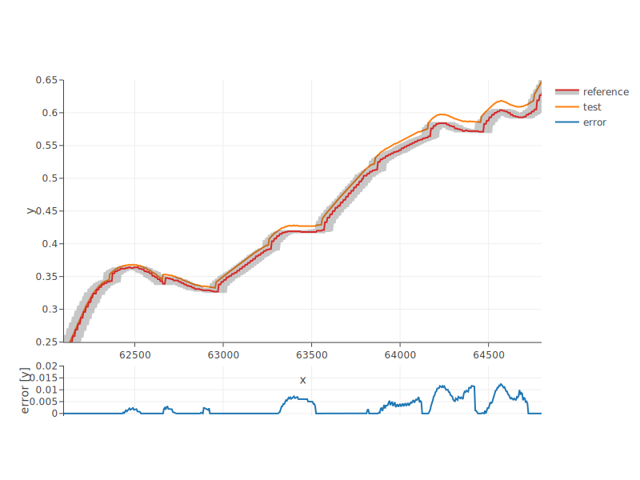

# funnel

[](https://travis-ci.org/lbl-srg/funnel)

A cross-platform C-based software for comparing two `(x, y)` data sets given tolerances in `x` and `y` directions.

Handles: different time (`x`) scales, time events offsets, relative and absolute tolerances
in `x` and `y` directions.

## Principles

### Overall

A so-called funnel is generated around the reference `(x, y)` data points.
The funnel is sized according to the absolute or relative tolerance in
both `x` and `y` directions.
The algorithm then checks if any test data points are inside the funnel,
and reports these points in the file `errors.csv` in the output directory.
Four other files are stored in the output directory: reference data points,
test data points, lower bounds and upper bounds of the funnel.

One potential application is to validate the development of building
HVAC control sequences. By comparing data curves from real operation with
data curves from simulation, one can verify if the control sequences
have been implemented such that they produce a similar control response
than a simulation model that is considered to be the original specification.

<p align="center">
  
</p>

### Method to Compute the Funnel

The funnel is computed as follows:

  * First step: tolerance areas (based on L1-norm, i.e., rectangles) are built
  around each reference data point.

  * Second step: the algorithm selects which corners of the tolerance rectangles
  are to be used to build the envelopes based on the change in the derivative sign at
  each reference point.

  * Third step: intersection boundary points are computed when a selected corner
  happens not to be in the logical order with the next one on the `x` scale (i.e. at a local extremum).
  New envelopes are then built encompassing all boundary points, and points strictly within
  the envelopes are dropped.

The comparison then simply consists of interpolating the upper and lower envelopes
at the `x` test values and comparing the yielded `y_up` and `y_low` values with the `y` test values.
By convention, the error is `max(0, y - y_up) - min(0, y - y_low)` and hence it is always positive.


## How to Run

### System Requirements

The software has been tested on the following platforms for which a library is provided in `./lib`:

  * Linux x64
  * Windows x64
  * Mac OS X

A Python binding is available to access the library. It is compatible with Python 2 and 3.

### Installing

The Python binding is delivered as a package named `pyfunnel`.

The package is not published on PyPI but can be installed from GitHub with `pip git+https://github.com/lbl-srg/funnel.git@master`.

For development, additional dependencies are needed and can be installed with `pip install -r requirements.txt`.

### Main Functions

The software is primarily intended to be used by means of a Python binding.
The package `pyfunnel` provides the following functions:

  * `compareAndReport`: calls `funnel` binary with list-like objects as `x`, `y` reference and test values.
    Outputs `errors.csv`, `lowerBound.csv`, `upperBound.csv`, `reference.csv`, `test.csv`
    into the output directory (`./results` by default).
    Note: At least one absolute or relative tolerance parameter must be provided for each axis.
    See function docstring for further details.

  * `plot_funnel`: plots `funnel` results stored in the directory which path is provided as argument.
    Displays plot in default browser. See function docstring for further details.

The module might also be called directly from terminal.
```
usage: pyfunnel.py [-h] --reference REFERENCE --test TEST [--output OUTPUT]
                   [--atolx ATOLX] [--atoly ATOLY] [--rtolx RTOLX]
                   [--rtoly RTOLY]

Run funnel binary from terminal.

Output `errors.csv`, `lowerBound.csv`, `upperBound.csv`, `reference.csv`, `test.csv` into the output directory (`./results` by default).

optional arguments:
  -h, --help            show this help message and exit
  --output OUTPUT       Path of directory to store output data
  --atolx ATOLX         Absolute tolerance along x axis
  --atoly ATOLY         Absolute tolerance along y axis
  --rtolx RTOLX         Relative tolerance along x axis
  --rtoly RTOLY         Relative tolerance along y axis

required named arguments:
  --reference REFERENCE
                        Path of CSV file with reference data
  --test TEST           Path of CSV file with test data

Note: At least one of the two possible tolerance parameters (atol or rtol) must be defined for each axis.
Relative tolerance is relative to the range of x or y values.

Typical use from terminal:
$ python {path to pyfunnel.py} --reference trended.csv --test simulated.csv --atolx 0.002 --atoly 0.002 --output results

Full documentation at https://github.com/lbl-srg/funnel
```

### Example

From a Python shell with `./tests/test_bin` as the current working directory, run
```python
>>> import pandas as pd
>>> import pyfunnel
>>> ref = pd.read_csv('trended.csv')
>>> test = pd.read_csv('simulated.csv')
>>> pyfunnel.compareAndReport(xReference=ref.iloc(axis=1)[0], yReference=ref.iloc(axis=1)[1],
... xTest=test.iloc(axis=1)[0], yTest=test.iloc(axis=1)[1], atolx=0.002, atoly=0.002)
>>> pyfunnel.plot_funnel('results')
```
Or from a terminal with `./tests/test_bin` as the current working directory, run
```
$ python ../../pyfunnel/pyfunnel.py --reference trended.csv --test simulated.csv --atolx 0.002 --atoly 0.002
```

## Build from Source

### System Requirements

The cross-platform build system relies on CMake version `3.11.*`.

The distributed binaries have been built with Microsoft Visual Studio C/C++ compiler
(Windows) and `gcc` (Linux and Mac).

### Procedure

To compile, link and install, from the top-level directory, run the following commands

```
mkdir build
cd build
cmake ..                           (add `-A x64` on Windows to compile in 64 bits)
cmake --build . --target install   (add `--config Release` on Windows)
```

To run the tests, from `./build` run the following commands
```
ctest                               (add `-C Release` on Windows)
python ../tests/test_summary.py ../tests
```

## License

Modified 3-clause BSD, see [LICENSE.md](LICENSE.md).

## Copyright

See [copyright notice](COPYRIGHT.md).
